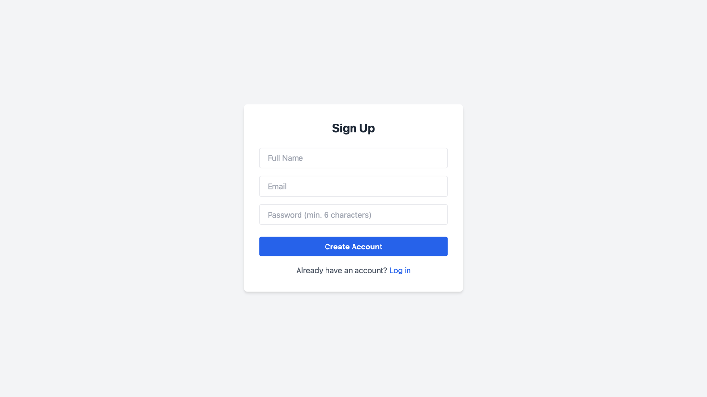

Steps to start project

1. clone frontend (this) repository: https://github.com/ruwanliyanage123/e-wallet-app
2. clone backend repository: https://github.com/ruwanliyanage123/e-wallet-api/
3. go to the e-wallet-app folder
   open the terminal and enter ``npm start`` command to start the frontend
4. open the terminal and enter ``npm run dev`` command to start the frontend

user login credentials:

- email": "test@test.com",
- password": "password123",
- name": "Ruwan"
